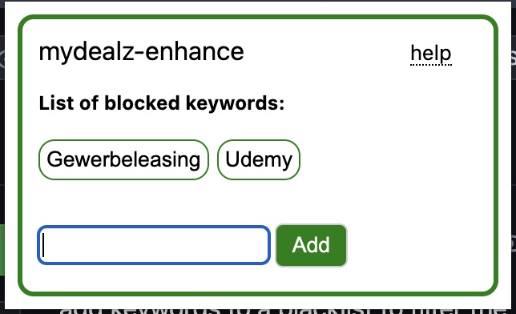

# mydealz_enhance

## Functionality

This is a browser extension that is also (soon) available on the chrome web-extension store.

Functions:
- add keywords to blacklist, deals that contain these in their title will be hidden
- option to reduce visual clutter by enabling custom css / other modifications

(Unfortunately this functionality is not provided by the website itself.)

## Development

I never did anything related to chrome extensions before and I heavily relied on ChatGPT when I put this together - so its probably far from perfect. If you spot any issues or have suggestions for improvements feel free to open an issue (or a pull request).

