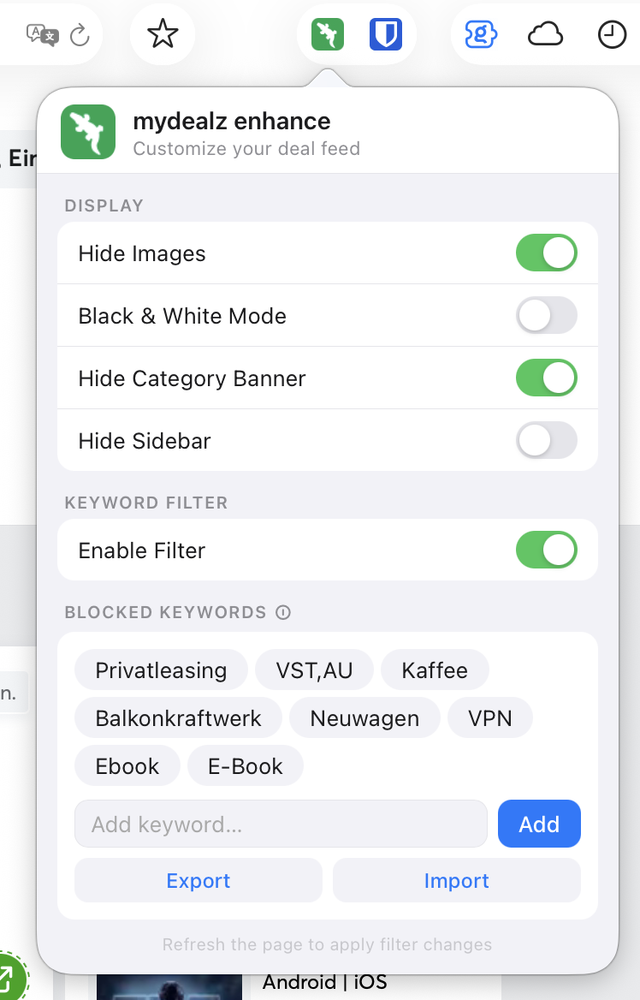

# mydealz_enhance


## Features

A browser extension that adds filtering and display customisation to [mydealz.de](https://www.mydealz.de).

- **Keyword filter** — blacklist keywords; deals containing them in their title are hidden. A toggle in the mydealz navigation bar lets you enable/disable filtering without opening the popup.
- **Hide images** — removes deal images for a cleaner list view
- **Hide category banner** — hides the category promo banner at the top of the page
- **Hide sidebar** — collapses the sidebar for a wider feed
- **Black & White mode** — applies a greyscale filter to the page *(not supported in Safari)*



## Usage

### Chrome & Edge

1. Download `chrome.zip` from the [releases section](../../releases) and unzip it.
2. Open `chrome://extensions` (Chrome) or `edge://extensions` (Edge).
3. Enable **Developer mode** (toggle in the top-right corner).
4. Click **Load unpacked** and select the unzipped folder.

### Firefox

> **Note:** Firefox does not allow permanently installing unsigned extensions in the standard release build. Use **Firefox Developer Edition** or **Firefox ESR** for a persistent install, or follow the temporary install steps below for testing.

**Temporary install (any Firefox, lost on restart):**
1. Download `firefox.zip` from the [releases section](../../releases) and unzip it.
2. Open `about:debugging` in Firefox.
3. Click **This Firefox** → **Load Temporary Add-on**.
4. Navigate into the unzipped folder and select `manifest.json`.

**Permanent install (Firefox Developer Edition / ESR only):**
1. Open `about:config` and set `xpinstall.signatures.required` to `false`.
2. Then follow the temporary install steps above — the extension will survive restarts.

### Safari

Safari wraps WebExtensions in a native macOS app. One-time setup with Xcode is required.

**Prerequisites:** macOS with [Xcode](https://developer.apple.com/xcode/) installed.

1. Download the source or clone the repository.
2. Run the converter in your terminal:
   ```bash
   xcrun safari-web-extension-converter /path/to/extension-folder
   ```
3. Copy the app icon into the generated project:
   ```bash
   cp images/Icon.png "<generated-project-name>/Shared (App)/Resources/Icon.png"
   ```
4. Xcode opens with a generated project. Press **Run** (▶) to build and install it.
5. Enable unsigned extensions: open **Safari → Settings → Advanced**, enable **Show Develop menu**, then open **Develop → Allow Unsigned Extensions**.
6. In Safari, open **Safari → Settings → Extensions** and enable **mydealz_enhanced**.

> **Note:** The extension stays installed permanently. However, **Allow Unsigned Extensions** resets every time Safari restarts — you only need to re-tick that toggle, not reinstall the extension.

> **Note:** `safari-web-extension-converter` requires the full **Xcode app** (not just the Command Line Tools). Install Xcode from the App Store, open it once to accept the license, then run `sudo xcode-select -s /Applications/Xcode.app/Contents/Developer` before retrying.

## Security / Privacy

The extension has the minimum permissions required to function (`activeTab`, `scripting`, `storage`). It does not send any data to external servers, stores everything locally, and does no tracking.

## Development

Contributions are welcome — feel free to open an issue or pull request if you spot a bug or have an idea for improvement.

I don't give any guarantees about functionality, compatibility, or ongoing support. Use at your own risk.
