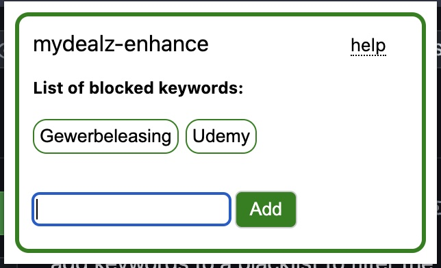

# 🐊 mydealz_enhance

## Functionality
This is a browser extension to add some custom functionality to the mydealz website.

Functions:
- add keywords to blacklist, deals that contain these in their title will be hidden (uncased string match)
- option to reduce visual clutter by enabling custom css / other modifications
    - grayscale mode
    - hide images
    - hide categories banner



## Usage

### Chrome & Edge

1. Download `chrome.zip` from the [releases section](../../releases) and unzip it.
2. Open `chrome://extensions` (Chrome) or `edge://extensions` (Edge).
3. Enable **Developer mode** (toggle in the top-right corner).
4. Click **Load unpacked** and select the unzipped folder.

### Firefox

> **Note:** Firefox does not allow permanently installing unsigned extensions in the standard release build. Use **Firefox Developer Edition** or **Firefox ESR** for a persistent install, or follow the temporary install steps below for testing.

**Temporary install (any Firefox, lost on restart):**
1. Download `firefox.zip` from the [releases section](../../releases) and unzip it.
2. Open `about:debugging` in Firefox.
3. Click **This Firefox** → **Load Temporary Add-on**.
4. Navigate into the unzipped folder and select `manifest.json`.

**Permanent install (Firefox Developer Edition / ESR only):**
1. Open `about:config` and set `xpinstall.signatures.required` to `false`.
2. Then follow the temporary install steps above — the extension will survive restarts.

### Safari

Safari wraps WebExtensions in a native macOS app. One-time setup with Xcode is required.

**Prerequisites:** macOS with [Xcode](https://developer.apple.com/xcode/) installed.

1. Download the source or clone the repository.
2. Run the converter in your terminal:
   ```bash
   xcrun safari-web-extension-converter /path/to/extension-folder
   ```
3. Xcode opens with a generated project. Press **Run** (▶) to build and install it.
4. In Safari, open **Safari → Settings → Extensions** and enable **mydealz_enhanced**.
5. If the extension doesn't appear: enable the Developer menu via **Safari → Settings → Advanced → Show Develop menu**, then check **Develop → Allow Unsigned Extensions**.

> The generated Xcode project does not need to be kept — re-run the converter command if you update the extension.
>
> **Note:** `safari-web-extension-converter` requires the full **Xcode app** (not just the Command Line Tools). Install Xcode from the App Store, open it once to accept the license, then run `sudo xcode-select -s /Applications/Xcode.app/Contents/Developer` before retrying.

Some day I might also publish it on the Google Chrome Extension Store.

I don't give any guarantees about the functionality, possible issues, compatibility or further support of this software.
You are using the extension on your own responsibility.

## Security / Privacy

I wrote this extension with good intentions and to the best of my knowledge it does not contain any vulnerabilities or other security issues or misconfigurations. The extension has the least privileges required for it to function (activeTab, scripting, storage).
It does not send any information to any servers and stores all information locally.
It does not do any tracking whatsoever.

## Development

I never did anything related to chrome extensions before and I heavily relied on ChatGPT when I put this together - so its probably far from perfect. If you spot any issues or have suggestions for improvements feel free to open an issue (or a pull request).


