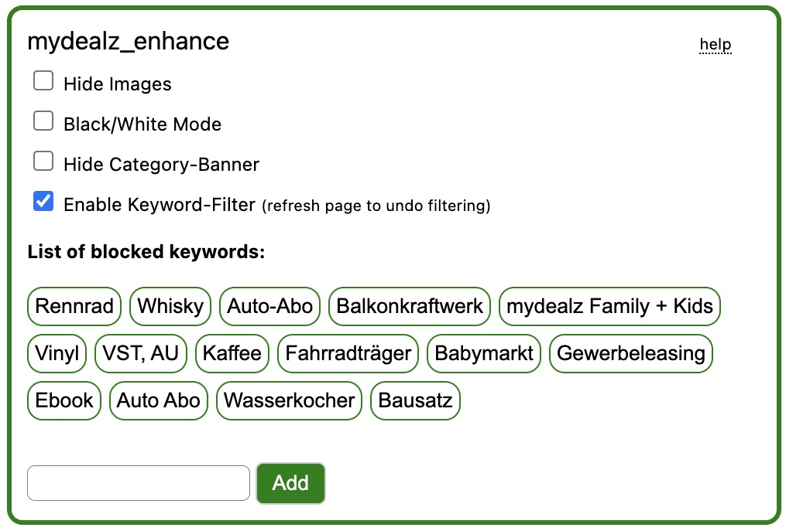

# 🐊 mydealz_enhance

## Functionality

This is a browser extension to add some custom functionality to the mydealz website.

Functions:
- add keywords to blacklist, deals that contain these in their title will be hidden (uncased string match)
- option to reduce visual clutter by enabling custom css / other modifications
    - grayscale mode
    - hide images
    - hide categories banner

## Development

I never did anything related to chrome extensions before and I heavily relied on ChatGPT when I put this together - so its probably far from perfect. If you spot any issues or have suggestions for improvements feel free to open an issue (or a pull request).

